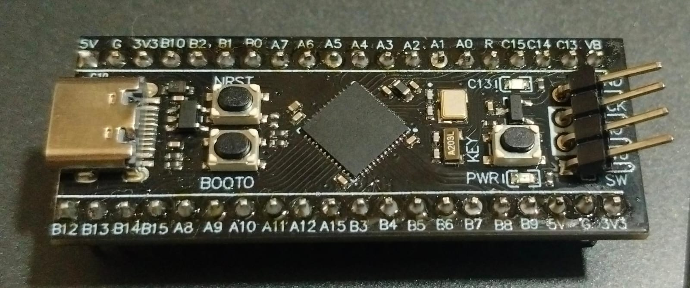
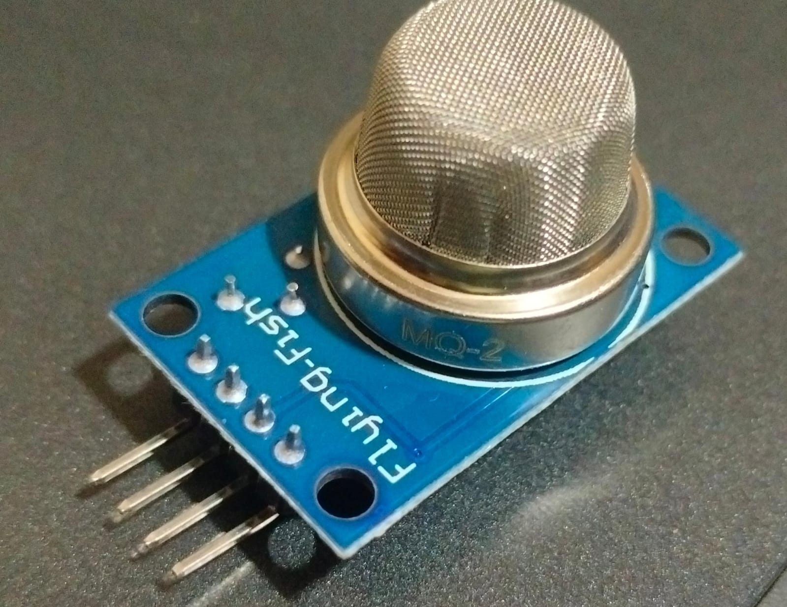
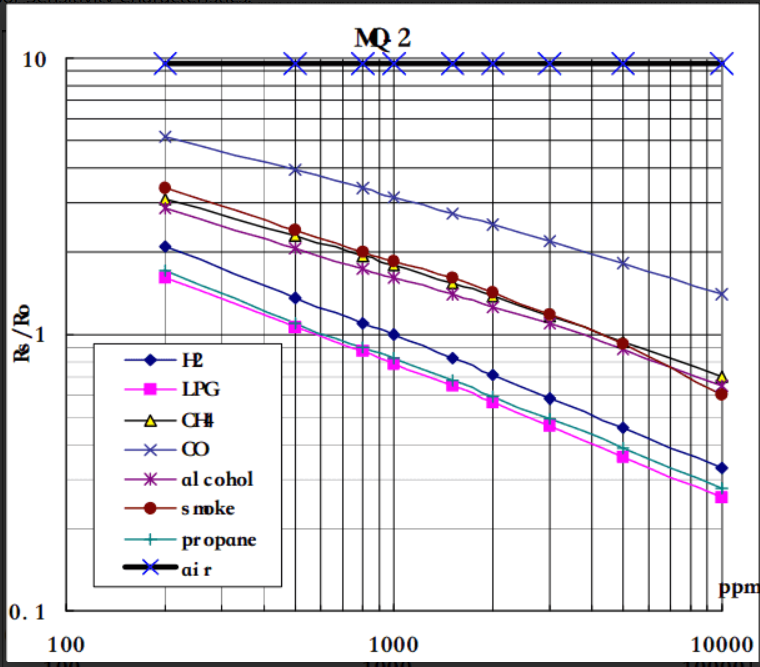
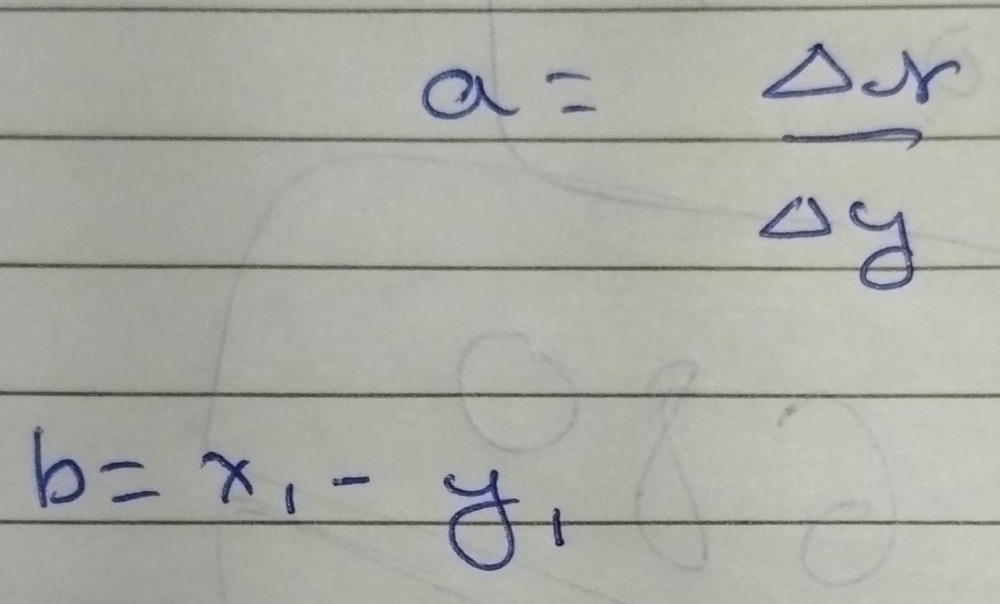
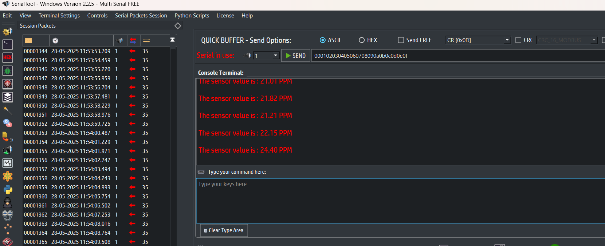

# 📘 MQ2 Sensor Driver – Detailed Documentation
This document explains the development, structure, and calibration of the MQ2 Gas Sensor driver for the STM32F401CCU6 microcontroller.
## 📸 1. Hardware Setup

### Components:
- STM32F401CCU6 ("Black Pill")
- MQ2 Gas Sensor Module
- Breadboard + Jumper Wires
- USB-UART/Serial Monitor
- Power Supply (5V for MQ2, 3.3V logic for STM32)

### Wiring:

| MQ2 Pin | Description | STM32 Pin |
|---------|-------------|------------|
| VCC     | +5V Power   | 3.3V         |
| GND     | Ground      | GND        |
| AOUT    | Analog Out  | PA1  |

## 🧠 2. Code Architecture

| Path          | File         | Purpose                            |
|---------------|--------------|-------------------------------------|
| MQ2/inc/      | UART.h       | UART interface headers              |
| MQ2/inc/      | adc.h        | ADC function declarations           |
| MQ2/inc/      | mq2_ppm.h    | Sensor calibration & PPM formulas   |
| MQ2/src/      | UART.c       | UART initialization and send data  |
| MQ2/src/      | adc.c        | Reads analog values from PA0        |
| MQ2/src/      | mq2_ppm.c    | Converts raw ADC to gas concentration |
| MQ2/          | main.c       | Demonstrates sensor usage and UART output |

## 🔍 3. MQ2 Sensor Working Principle

The MQ2 sensor detects gas concentrations based on a change in resistance of a heated sensitive material(TIN DIOXIDE). The sensor outputs an analog voltage proportional to gas concentration.

- **Rs**: Sensor resistance in gas
- **Ro**: Sensor resistance in clean air

The relationship follows this equation:

Where `A` and `B` are constants from the MQ2 datasheet (varies by gas type).

---

## 🧪 4. Calibration Method

1. **Environment**: Sensor powered on for 24 hours in clean air (burn-in time).
2. **Measured Ro**: Using voltage divider formula:                          Rs = (Vc * RL / Vout) - RL
3. **Known Clean Air Value**:
- `Rs/Ro ≈ 9.8` in clean air (from MQ2 datasheet)
- Calculated `Ro` using average `Rs / 9.8`

## Constant's A and B 
The constants value is not given in many datasheets so you may have to find on your own .
First of we have to understand that the MQ2 sensor responda to change in multiple gases ,following is its sensitivity curve provided in the datasheet

So the graph here is a Logarithmic graph , you must understand how to read a logarithmic graph . YT link : https://www.youtube.com/watch?v=GJ8S9q1R_bg

So we can see that the X-Axis is PPM and the Y-Axis is ratio Rs/Ro.

It is also of form y=mx+b where m is slope . We can also write it as y=ax+b ,so a is slope and b is the y intercept also  y is log(PPM) & x is log(Rs/Ro).

Now if we solve for a and b we get  :  a=x2-x1/y2-y1  and b=x1-ay1

Here to get x1,x2,y1 and y2 : Select any 2 points which are clearly visible on the graph for any gas you select mark them as P1(x1,y1) and P2(x2,y2).

Once you get them use them in your code .

### I found the constant as :
                        - 1. LPG gas a=(-2.347),b=2.780.
                        - 2. H2 gas  a=(-1.45),b=3.
                        - 3. CH4 gas  a=(-3.021),b=3.742.
                        - 4. CO gas   a=(-3.811),b=4.818.
Update the value of constant in code according to the gas you want to measure.

## Serial Output :

## References : 
1. https://www.pololu.com/file/0j309/mq2.pdf
2. https://community.st.com/t5/stm32cubeide-mcus/fpu-is-not-initialized/td-p/620629

